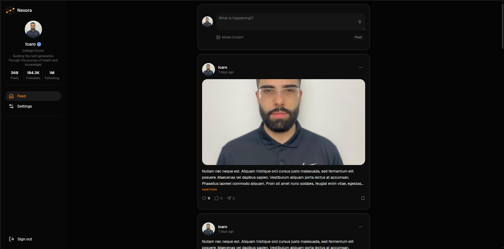

<div align="center">
  

  # Nexora

  A full-stack social media platform built with a GraphQL API, React 19, and Node.js 22.

  [**Live Demo →**](https://nexora.kiiler.com/)

  [](./LICENSE)

</div>

---

## Tech Stack

**Backend** &nbsp; [](https://nodejs.org/) [](https://www.typescriptlang.org/) [](https://expressjs.com/) [](https://www.apollographql.com/docs/apollo-server/) [](https://graphql.org/) [](https://www.mongodb.com/) [](https://aws.amazon.com/)

**Frontend** &nbsp; [](https://react.dev/) [](https://www.typescriptlang.org/) [](https://vitejs.dev/) [](https://www.apollographql.com/docs/react/) [](https://tailwindcss.com/) [](https://ui.shadcn.com/)

---

## Preview



---

## Features

- **Authentication** — register, login, logout, and a full password-reset flow via email
- **Feed** — infinite-scroll timeline of posts with cursor-based pagination
- **Posts** — create text and media posts (images); delete your own
- **Real-time** — new posts appear live via GraphQL Subscriptions
- **Interactions** — like and comment on posts
- **Profiles** — bio, position, avatar upload, and per-user media storage quota
- **Settings** — light / dark / system theme preference persisted per account

---

## Architecture

Key engineering decisions behind Nexora:

- **DataLoaders** — all GraphQL field resolvers batch database queries through DataLoader, eliminating N+1 query problems across nested types (`Post → comments`, `Post → likes`, `Comment → author`)
- **JWT + hashed refresh tokens** — access tokens expire in 15 minutes; refresh tokens are SHA-512 HMAC-hashed before storage so a database breach never exposes raw tokens
- **S3 presigned uploads + CloudFront CDN** — media is uploaded directly from the client to S3 via presigned POST URLs and served through signed CloudFront URLs, with per-user storage quota enforcement at the API layer
- **GraphQL Codegen** — TypeScript resolver and client types are generated from the GraphQL schema at build time, ensuring full-stack type safety without manual synchronization between packages
- **AWS Secrets Manager** — all production credentials are fetched from Secrets Manager at runtime; no secrets live in environment files or the repository

See [`backend/README.md`](./backend/README.md) and [`frontend/README.md`](./frontend/README.md) for a deeper dive into each layer.

---

## Getting Started

```bash
git clone https://github.com/your-username/nexora.git
cd nexora
```

Then follow the setup guides for each package:

- [Backend setup →](./backend/README.md#getting-started)
- [Frontend setup →](./frontend/README.md#getting-started)

---

## License

Distributed under the MIT License. See [`LICENSE`](./LICENSE) for details.
